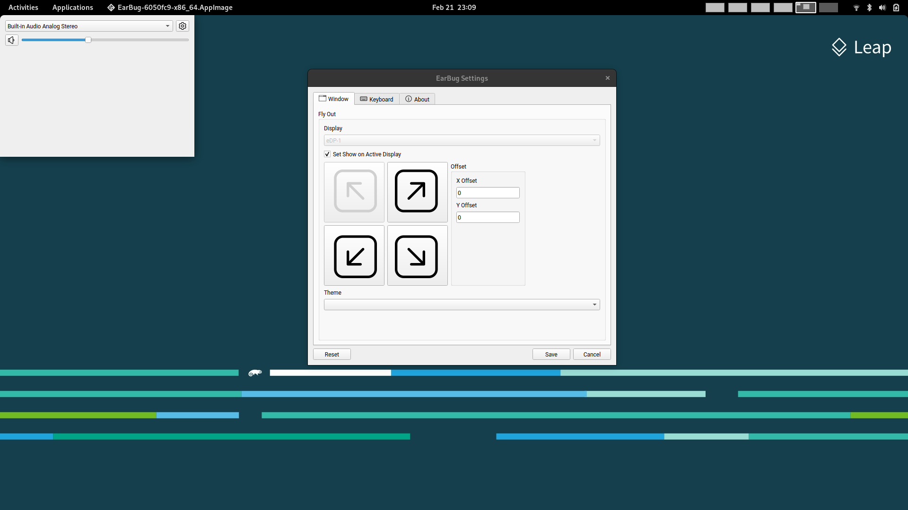

# EarBug

    

## Awards

None Yet

## Media coverage

Nothing here either! 

## Sponsors

Support the project on [Ko-Fi](https://ko-fi.com/demilovato)

## Planned Features

* Visualize audio with multi-channel aware peaking
* Standalone volume mixer
* Move apps between playback devices
* Default playback device management
* Automatic updates via the Microsoft Store
* Support for light/dark mode and all accent colors
* Configurable hotkeys
* Modern context menus

## Internationalization

Is planned in future releases

## Install

Download the repo and build, requires Qt6, LibPulse, X11, CMake and a C++ compiler. 
Eventually to be distributed via an AppImage
 
## Experimental dev builds

Basically where we are at!

## Documentation
* [Technical Information](./README.md)
* [Compiling EarBug](./COMPILING.md)
* [Contributing to EarBug](./CONTRIBUTING.md)
* [Information Collected And Transmitted By EarBug](./PRIVACY.md)
* [Project License](./LICENSE)
* [Change Log](./CHANGELOG.md)

## Supported operating systems
- OpenSUSE
- Zorin
- Ubuntu
- Debian

## Credits
- Demetry Romanowski ([DemiRom](https://github.com/demirom))
- [Contributors](https://github.com/DemiRom/EarBug/graphs/contributors)
